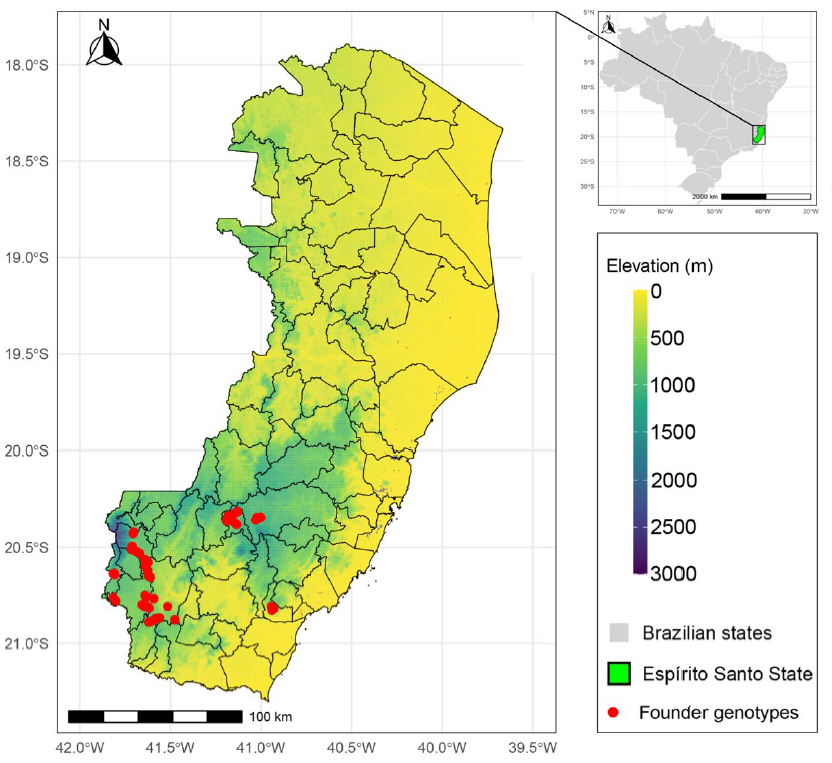

# Euterpe edulis: Morphometrics, Germination, and Genetic Divergence

This repository contains supporting material for the article:

**Canal GB, Péres MZ, de Almeida FAN, Araújo MS, Tetzner de Oliveira J, Santos JG, de Souza GB, Ferreira MFS, Alexandre RS, Ferreira A. (2025).**  
*Uncovering morphometric, germination, and genetic divergence patterns in Euterpe edulis for breeding and conservation applications.*  
Scientific Reports 15:33038. https://doi.org/10.1038/s41598-025-02606-7

---

## About the study

The study investigates **fruit and seed morphometrics, germination performance, seedling growth, and molecular diversity** in *Euterpe edulis*.  
Key contributions include:

- Estimation of variance components and heritability using REML/BLUP.  
- Correlation and path analysis to identify direct effects on seedling quality.  
- Assessment of genetic divergence among 72 genotypes with SSR markers.  
- Practical recommendations for germplasm conservation and breeding programs.  

These results provide valuable insights for the establishment of **ex situ germplasm collections** and the development of a breeding foundation population for this threatened Atlantic Forest palm.

---

## Repository contents

- `data_markers.txt` — allele size data from microsatellite (SSR) genotyping.  
- `fig.png` — figure from the publication illustrating the study’s findings.  

---

## Figure

---

## Citation

If you use this repository, please cite the article:

> Canal GB, Péres MZ, de Almeida FAN, Araújo MS, Tetzner de Oliveira J, Santos JG, de Souza GB, Ferreira MFS, Alexandre RS, Ferreira A. 2025.  
> *Uncovering morphometric, germination, and genetic divergence patterns in Euterpe edulis for breeding and conservation applications.*  
> Scientific Reports 15:33038. https://doi.org/10.1038/s41598-025-02606-7
